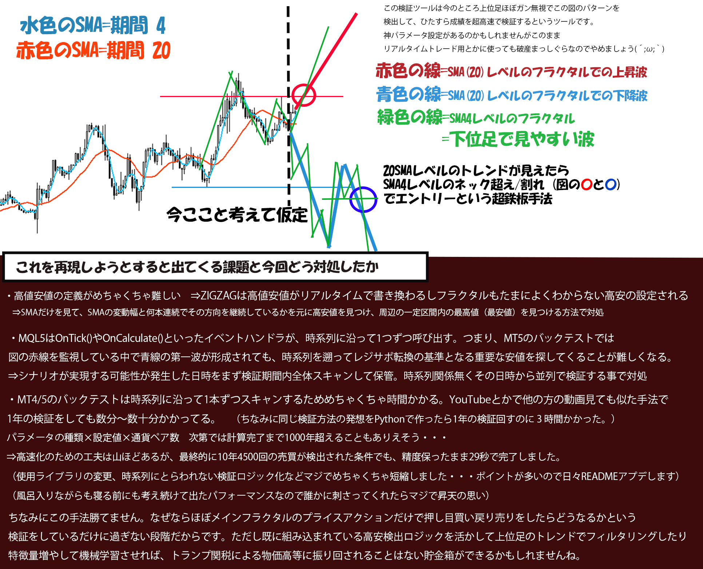

# 為替トレードバックテスト検証ツール

## EA検証に時間がかかりすぎてにお困りなのがきっかけでこのページを見つけたあなたへ

このツールで使ってる手法や、このREADMEで説明している要素をｷﾞｭｯｯｯっとした画像を作りました。為替取引したことがあれば、1分眺めてるとツールとページの内容を大体把握できると思います。




## ここからちゃんとした概要

※注意

１・エンジニアでもない人間が書いたコードなのでいわゆる「クソコード」が多いかもしれません。ご自身で見やすいようにしてください・・・

２・7/7 現時点ではgeminiにAIを作ってもらった段階です。見た感じ正しくない内容がちょこちょこあります。7月中旬頃にはさらに詳しく正確なREADMEを公開できるようにします

３・もしツールを動かしたい場合、csvを証券会社からダウンロードして、pklファイル変換が必要です。このレポジトリは発想まとめみたいな意味合いで公開しています。


このプロジェクトは、外国為替（FX）市場における特定の取引戦略の有効性を検証するためのバックテストツール、および将来的なリアルタイム取引への拡張を目的とした自動売買システムです。

単純なゴールデンクロスやデッドクロスのような一般的なシグナルに依存せず、複数のテクニカル指標（移動平均線、ピボット、フィボナッチリトレースメント）とセッション情報を組み合わせた、より複合的な条件でエントリーポイントを判断するロジックを検証しています。

また、大量の過去データを用いた高速なバックテストを実現するため、データ形式の工夫（Pickle化）、並列処理による計算の高速化、NumPy/Pandasライブラリによるベクトル演算など、パフォーマンスを重視した設計をしています。

## 主な特徴

-   **複合的なエントリーロジック**: 複数のテクニカル指標を組み合わせた、独自の押し目買い・戻り売り戦略を検証します。
-   **高速バックテスト**: NumPyによるベクトル演算、並列処理、データキャッシングにより、大量のデータでも高速に検証できます。
-   **セッション分析**: 東京、ロンドン、ニューヨークといった主要市場のセッション時間に基づいた分析機能を持ちます。
-   **柔軟なデータ管理**: CSVデータから高速なPickle形式への変換機能を備えています。
-   **詳細なログ出力**: トレード��と��詳細なログをCSVファイルに出力し、詳細な分析が��能です。

## 取引戦略について

このツールで検証しているのは、単純なトレンドフォロー戦略ではありません。主なアイデアは以下の通りです。

**「短期的な相場の過熱感や調整局面を狙った、押し目買い・戻り売り戦略」**

具体的なエントリー条件は、以下のような複数の要素を組み合わせて判断されます。

1.  **トレンドの方向性**: 中長期の移動平均線（例: 75MA）を用いて、全体的なトレンドの方向を把握します。
2.  **エントリーのタイミング**:
    -   短期の移動平均線（例: 20MA）とローソク足の位置関係から、短期的な調整局面（押し目・戻り）を判断します。
    -   これは、**ゴールデンクロスを待つのではなく、トレンド方向に価格が一時的に調整したタイミングを狙う**という工夫点です。
3.  **サポート＆レジスタンス**:
    -   **ピボット (Pivot Points)**: 前日の価格から計算されるサポートラインとレジスタンスライン。
    -   **フィボナッチ・リトレースメント (Fibonacci Retracement)**: 直近の高値・安値から計算される押し目・戻りの目安。
    -   これらのライン付近での反発をエントリーの根拠として加えます。
4.  **セッション情報**: 特定の市場（例: ロンドン市場）が開いている時間帯はボラティリティが高まる傾向があるため、セッション情報をエントリー条件の一部として考慮します。

これらの条件を複合的に組み合わせることで、より精度の高いエントリーポイントを探ることを目的としています。

## セットアップと実行方法

### 1. 前提条件

-   Python 3.8以上
-   必要なライブラリ: `pandas`, `numpy`など。（`requirements.txt`がないため、必要に応じてインストールしてください）

### 2. リポジトリのクローン

```bash
git clone https://github.com/neoaamu2000/forex_old.git
cd forex_old
```

### 3. データ（Pickleファイル）の準備

**重要**: このリポジトリには、バックテストを高速に実行するための`pickle`形式のデータファイル���含ま���ていません。初回実行前、またはCSVデータを更新した際には、必ずデータ変換処理を実行する必要があります。

`test_file/currency_data/`内に配置されている`USDJPY_data.csv`などのソースデータから、`manage_data.py`などのデータ管理スクリプトを用いて`pickle`ファイルを生成します。csv読み込みのまま読み込む形式にしても良いですが、読み込みだけで数十秒要することになるため、pklを一度生成することをお勧めします。

```bash
# manage_data.pyやそれに類するスクリプトでデータ変換を実行する例
python manage_data.py --convert-to-pickle
```

これにより、`test_file/pickle_data/`ディレクトリ内に、処理済みのデータが保存され、バックテスト時に高速に読み込めるようになります。

## 処理フロー（バックテスト）

このプロジェクトの根幹をなすバックテスト処理は `test_file/main.py` の `process_data` 関数からキックオフされます。リアルタイム処理とは異なり、指定された期間のデータを一度に処理し、取引戦略の有効性を検証します。処理は主にNumPy配列を用いて高速に行われます。

1.  **初期設定とデータ読み込み (`process_data`関数)**
    -   バックテストの全処理は、この関数から始まります。まず、`conditions`という辞書型変数で、テストの挙動を決定する全てのパラメータを一元的に受け取ります。これには、通貨ペア（`symbol`）、テスト期間（`fromdate`, `todate`）、使用する移動平均線の期間（`BASE_SMA`, `SML_SMA`）、各種判定の閾値（`BASE_threshold`など）が含まれます。
    -   次に、`pd.read_pickle()`を用いて、指定された通貨ペアの過去データを高速に読み込みます。この`.pkl`ファイルは、事前にCSVから変換されたPython専用のバイナリ形式であり、テキスト形式のCSVを毎回解析するのに比べて、データの読み込み時間を劇的に短縮します。
    -   読み込んだデータは、`conditions`で指定された期間（`fromdate`から`todate`まで）に絞り込まれます。
    -   最後に、処理速度を最大化するため、Pandas DataFrameからNumPy配列 `np_arr` にデータを変換します。以降の計算は、高度に最適化されたベクトル演算が可能なこのNumPy配列を主軸として行われます。

2.  **テクニカル指標の計算 (`pre_data_process`関数)**
    -   この関数は、後の分析で必要となる主要なテクニカル指標を事前に計算し、データ配列に付与する役割を担います。このプロジェクトでは、役割の異なる2つの単純移動平均線（SMA）を計算します。
        -   **BASE_SMA (基準SMA)**: デフォルトでは20期間。相場全体の大きな流れや「波」を定義するための基準となります。後述するピボット（波の頂点や底）の検出は、主にこのBASE_SMAの動きに基づいて行われます。
        -   **SML_SMA (短期SMA)**: デフォルトでは4期間。より短期的な値動きや、エントリー・決済のタイミングを計るためのトリガーとして使用されます。
    -   **SMAの計算 (`calculate_sma`関数)**:
        -   内部では、Pandasの`rolling()`メソッドを用いて移動平均を計算しています（例: `series.rolling(window=20).mean()`）。これは、Pythonの`for`ループで1行ずつ計算するのに比べて圧倒的に高速なベクトル演算です。
    -   **トレンド方向の判定 (`determine_trend`関数)**:
        -   計算されたSMAを元に、現在の短期的なトレンドの方向を判定します。
        -   具体的には、`np.diff`でSMAの連続する値の差分（傾き）を計算し、その符号（プラスかマイナスか）を`np.sign`で判定します。結果は、上昇トレンドなら`1.0`、下降トレンドなら`0.0`という数値データとして、元のNumPy配列に新しい列として追加されます。これもまた、ループを使わない高速なベクトル演算です。
    -   このステップが完了すると、元の価格データに「BASE_SMA」「SML_SMA」「トレンド方向」といった分析用の情報が付与された、リッチなデータ配列が完成します。

3.  **ピボット（波の頂点と底）の検出 (`detect_pivots`関数)**
    -   この関数は、分析の核となる**「波の転換点」**を特定する重要な役割を担います。BASE_SMAとSML_SMA、それぞれに対して実行されます。
    -   **ピボットの定義**:
        -   単純な高値・安値ではなく、**「SMAがある程度の期間、一方向に進んだ後の転換点」**をピボットとして定義します。これにより、小さなノイズに惑わされず、意味のある規模の波だけを抽出できます。
    -   **検出ロジック**:
        1.  まず、ステップ2で判定したトレンド方向（`trend_arr`）が、パラメータで指定された本数（`consecutive_bars`）以上、継続していることを確認します。これにより、単なる一時的な反発ではなく、一定の勢いを持った動きであることを保証します。
        2.  次に、現在のSMAの価格が、過去の一定期間（`LOOKBACK_BARS`）における最高値（または最安値）から、指定された閾値（`POINT_THRESHOLD`）以上、離れているかを判定します。
            -   **上昇トレンド中の高値���ボット（天井）検出**: `(期間中のSMA最高値 - 現在のSMA) >= 閾値`
            -   **下降トレンド中の安値ピボット（谷）検出**: `(現在のSMA - 期間中のSMA最安値) >= 閾値`
        3.  上記の条件を満たした場合、その期間内の実際のローソク足の最高値（または最安値）をピボット価格として記録します。SMAではなく、実際の価格を記録するのがポイントです。
    -   この処理により、`pivot_data`配列には、検出されたピボットの「検出時刻」「ピボットの発生時刻」「ピボット価格」「種類（高値/安値）」が格納されます。

4.  **波（セッション）の生成 (`WaveManager.add_session`メソッド)**
    -   このメソッドは、ステップ3で検出された**BASE_SMAのピボット**を元に、具体的な分析対象となる**「波（セッション）」**を定義し、管理下に置きます。
    -   **波の定義**:
        -   「前回検出されたピボット」から「今回新しく検出されたピボット」までを、一つの独立した「波」とし���扱います。
        -   例えば、「安値ピボット → 高値ピボット」であれば**上昇波**、「高値ピボット → 安値ピボット」であれば**下降波**として定義されます。
    -   **インスタンスの生成**:
        -   新しい波が定義されるたびに、その波の情報を専門に扱う`MyModel`クラスのインスタンスを生成します。
        -   このインスタンスには、波の始点と終点のインデックス、トレンド方向、そしてパラメータで指定された決済戦略（`"fibo"`または`"sml"`）といった、分析に必要な初期情報がすべて渡されます。
    -   `WaveManager`は、こうして生成された多数の`MyModel`インスタンス（＝多数の波）を、次の分析フェーズまで一元的に管理します。

5.  **各波の分析とエントリー判定 (`WaveManager.analyze_sessions`メソッド)**
    -   このメソッドは、`WaveManager`が管理している全ての「波」のインスタンス（`MyModel`）に対して、分析とトレードシミュレーションを実行するよう指示を出す、バックテストの実行部隊です。
    -   **データスライスの最適化**:
        -   各`MyModel`インスタンスは、分析に必要な期間のデータだけを切り出して（スライスして）受け取ります。これにより、各インスタンスが巨大な全期間データを参照する必要がなくなり、メモリ効率と処理の独立性が向上します。
    -   **状態遷移によるロジック実行 (`MyModel.execute_state_action`メソッド)**:
        -   各`MyModel`インスタンスは、自身が今どの状態にあるか（`self.state`）に応じて、実行するべき処理を決定します。これは**ステートマシン**という考え方に基づいています。
        -   例えば、「基準となる波ができた直後 (`created_base_arrow`)」の状態から、「エントリー条件が整うのを待っている (`infibos`)」状態へ、そして「ポジションを保有中 (`has_position`)」の状態へと、条件を満たすたびに遷移していきます。
    -   **エントリー条件の複合判定**:
        -   エントリーの最終決定は、`handle_infibos`や`potential_entry`といったメソッド内で行われます。
        -   ここでは、単一のシグナルではなく、これまでのステップで準備された複数の情報を複合的に評価します。
            -   **フィボナッチ・リトレースメント**: 基準となる波（BASE_SMAの波）に対して、価格が適切な押し目・戻りのレベル（例: 38.2%〜70%のゾーン）に到達したか。
            -   **短期的な反転シグナル**: 短期SMA（SML_SMA）のピボットを「ネックライン」とみなし、そのネックラインをブレイクしたか。あるいは、短期SMAの向きが再度トレンド方向に転換したか。
            -   **追加のフィルター**: 他のSMA群（例: 75MAなど）との位置関係をチェックし、エントリーの優位性が高い局面（例: すべてのMAが同じ方向を向いているパーフェクトオーダー状態）に絞り込むことも可能です。
        -   これらの条件がすべて満たされた時、初めてエントリーが実行され、状態は`has_position`に遷移します。
    -   **決済��略の選択**:
        -   `has_position`状態に遷移すると、次は決済のフェーズです。
        -   決済ロジックは、パラメータ設定（`conditions`内の`stop`キー）によって、以下の2種類から選択されます。
            1.  `"stop": "fibo"`: **固定目標決済**。エントリー時に決定した固定の利確・損切りラインを目指します。
            2.  `"stop": "sml"`: **ネックライン追従決済**。相場の動きに合わせて動的に決済ラインを更新します。
        -   詳細は次の「6. 決済ロジックと結果の集計」で解説します。

6.  **決済ロジックと結果の集計**
    -   全ての波の分析が完了した後、`trade_logs`に記録された全トレード結果を集計し、最終的な統計情報を算出します。決済の判定は、選択された戦略に応じて以下のルールで実行されます���

    #### 6.1. `"fibo"` 戦略：固定目標決済
    この戦略は、エントリー時に算出された**固定の利確ライン**と**固定の損切りライン**の、どちらに価格が先に到達するかを監視するシンプルなモデルです。
    -   **利確ラインの算出**:
        -   エントリーの根拠となった「調整波」の長さを基準に、**フィボナッチ・エクステンション**を用いて計算されます。
        -   パラメータ`tp_level`（例: 138）を使い、「調整波の長さ × 1.38」分だけ価格が伸びたポイントを利確目標とします。
    -   **損切りラインの算出**:
        -   エントリー直前の相場における**直近の重要な安値（押し安値）または高値（戻り高値）**を基準に、一定のバッファを持たせた価格が設定されます。これは、トレンドの前提が崩れると判断される重要な価格水準です。
    -   **決済判定**:
        -   エントリー後、価格がこの固定された利確ラインと損切りラインのどちらか一方に先に到達した時点で決���されます。
        -   **特殊ケース**: 1本のローソク足の中で両方のラインに同時にヒットした場合、より現実的な期待値に近づけるため、両ラインの**中間価格**で決済され、結果は`breakeven`（引き分け）として記録されます。

    #### 6.2. `"sml"` 戦略：ネックライン追従決済
    この戦略は、短期移動平均線（SML）が形成するピボット（高値・安値）を**「ネックライン」**とみなし、相場の動きに追従しながら動的に決済を判断する、より複雑で機敏なモデルです。決済は以下の3つのルールに基づいています。

    1.  **ルール1：初期損切り（完全な負け）**
        -   エントリー後、SMLピボット（ネックライン）が1つも形成されることなく、価格が`fibo`戦略と同様の**初期損切りライン**に到達した場合。
        -   これはトレンドの前提が完全に崩れたと判断され、結果は`loss`（負け）として記録されます。

    2.  **ルール2：第1ネックライン割れ決済（微損 or 微益）**
        -   初期損切りに到達する前に、最初のSMLピボット（＝**第1ネックライン**）が形成されると、このラインが新しい監視対象になります。
        -   価格がこの第1ネックラインをブレイクした時点で決済されます。
            -   決済価格がエントリー価格より不利な場合、本来の初期損切りよりは浅い傷で済んだという意味を込めて**`微損`**と記録されます。
            -   決済価格がエントリー価格より有利な場合は**`win`**（勝ち）となります。

    3.  **ルール3：トレーリング利確（勝ち確定）**
        -   第1ネックラインを割ることなく価格がトレンド方向に進み、2つ目のSMLピボット（＝**第2ネックライン**）が形成された時点で、**負けは無くなった**と判断し、利確モードに移行します。
        -   以降は、**「直前に形成されたSMLピボット」**を新しい利確ラインとして、価格がそのラインをブレイクするまで追いかけ続けます。これにより、利益を伸ばしつつ、相場の��換に素早く反応して利益を確定させることを目指します。

    #### 6.3. 最終的な統計情報の出力
    -   `summarize_and_export_results()`: 上記のいずれかの戦略で記録された全トレードログを元に、以下の統計情報を計算し、最終的なCSVファイルに追記します。
        -   **プロフィットファクター**: 総利益 ÷ 総損失
        -   **平均リスクリワード比率**: 各トレードの (利益幅 ÷ 損失幅) の平均
        -   **最大連敗数**: 連続した負けトレードの最大回数
        -   **勝率**: `result`が`win`のトレードの割合
        -   **最大ドローダウン（シミュレーション）**:
            -   初期資金（例: 10,000）に対し、各トレードで資金の一定割合（例: 3%）をリスクに晒す動的リスク管理をシミュレートします。
            -   このシミュレーション上の資金推移における、ピークからの最大下落額を算出します。
        -   **資金推移グラフの元データ**: 上記シミュレーションの各トレード後の資金を記録���、グラフ描画用のデータとして出力します。

    #### 6.4. 決済判定の高速化手法（ベクトル演算の活用）
    バックテストでは膨大な数のローソク足に対して決済条件を判定する必要があり、この処理速度は全体のパフォーマンスに大きく影響します。このプロジェクトでは、処理を高速化するために**NumPyによるベクトル演算**を全面的に採用しています。

    **一般的な手法（低速なループ処理）:**

    最も直感的な方法は、エントリー後のローソク足を`for`ループで1本ずつ順番に見ていくことです。

    ```python
    # 低速なアプローチの例
    exit_index = -1
    for i in range(len(data_slice)):
        # 1本ずつ価格をチェック
        if data_slice[i, 'low'] <= stop_loss_price:
            exit_index = i
            break # ヒットしたらループを抜ける
    ```

    この方法は、データ量が少ない場合は問題ありません。しかし、Pythonの`for`ループは大規模なデータ配列の処理には向いておらず、数十万本以上のローソク足を処理する際には非常に低速になります。

    **本プロジェクトの手法（高速なベクトル演算）:**

    本プロジェクトでは、ループ処理を避け、NumPyの機能を最大限に活用します。

    ```python
    # 高速なアプローチ（実際のコードで使用）
    # 期間全体の安値配列と損切りラインを一度に比較
    sl_hit_conditions = data_slice[:, 3] <= stop_loss_price 

    # 条件に合致した全てのインデックスを一度に取得
    sl_hit_indices = np.where(sl_hit_conditions)[0]

    if sl_hit_indices.size > 0:
        # 最初にヒットした足のインデックスを取得
        exit_index = sl_hit_indices[0]
    ```

    このアプローチは、以下のような流れで動作します。

    1.  **一括比較**: `data_slice[:, 3] <= stop_loss_price` の部分で、エントリー後の期間全体の安値データ（配列）と損切り価格を**一度の操作で**比較します。これにより、各足が条件を満たすかどうかのブール配列（`[False, False, True, True, ...]`）が生成されます。
    2.  **インデックス抽出**: `np.where()` は、このブール配列の中から `True` になっている要素の**インデックス（位置）だけを効率的に抜き出し**ます。
    3.  **最初のインデックスを取得**: 最後に、抜き出されたインデックスの配列から最初の要素（`sl_hit_indices[0]`）を取得するだけで、最初に損切りにヒットした足が特定できます。

    このベクトル演算は、内部的に高度に最適化されたC言語のコードで実行されるため、Pythonの`for`ループで1本ずつ処理するのに比べて、**数十倍から数百倍高速**に動作します。これにより、年単位の長期的なバックテストでも、現実的な時間で結果を得ることが可能になっています。


## パフォーマンス向上のための工夫

このプロジェクトでは、高速な検証サイクルを実現するために、以下の技術的な工夫が施されています。

### 1. NumPy/Pandasによるベクトル演算

-   金融データのような大規模な時系列データを扱���際、Python標準の`for`ループで各行を処理すると非常に低速になります。
-   本プロジェクトでは、`NumPy`および`Pandas`ライブラリを全面的に活用しています。これにより、移動平均の計算や条件判定などを「ベクトル演算」として一括で処理できます。
-   ベクトル演算は、内部的にC言語などの高速な言語で実装されているため、ループ処理に比べて数十倍から数百倍高速に動作します。

### 2. 並列処理による計算高速化

-   バックテスト、特にパラメータの最適化を行う際には、膨大な量の計算が必要です。
-   `test_file/main_parallels.py`からわかるように、`multiprocessing`などのライブラリを利用して、計算処理を複数のCPUコアに分散させています。
-   これにより、異なる通貨ペアや異なるパラメータ設定のバックテストを同時に実行でき、全体の検証時間を劇的に短縮します。

### 3. データキャッシング（Pickle形式の利用）

-   数十MBから数百MBになることもあるCSVファイル���、テキスト形式であるため、プログラム実行のたびに解析（パース）に時間がかかります。
-   `pickle`は、Pythonオブジェクトをバイナリ形式でシリアライズ（保存）するための仕組みです。
-   一度`DataFrame`オブジェクトとして読み込んだデータを`pickle`ファイルとして保存しておくことで、次回以降はテキストの解析が不要になり、データの読み込み時間を大幅に短縮できます。

## ディレクトリ構成

-   `リアルタイム本番用/`: 実際の取引口座と連携して動作させるための本番用コードが格納されています。
-   `test_file/`: バックテストに関連するファイル群。データ、テスト用スクリプト、検証結果などが含まれます。
-   `セッション開発用ファイル/`: 市場セッションに関連する機能の開発・検証用ファイルが格納されています。
-   `アーカイブ/`: 過去のバージョンのコードや、実験的に作成したスクリプトが保管されています。
-   `矢印表示用/`: `matplotlib`などを利用���て、チャート上に売買シグナルを矢印で表示するためのスクリプトです。
